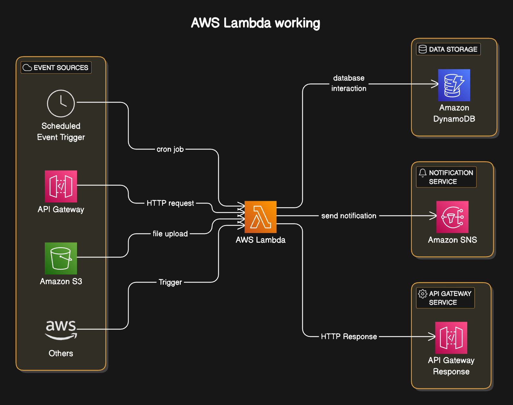
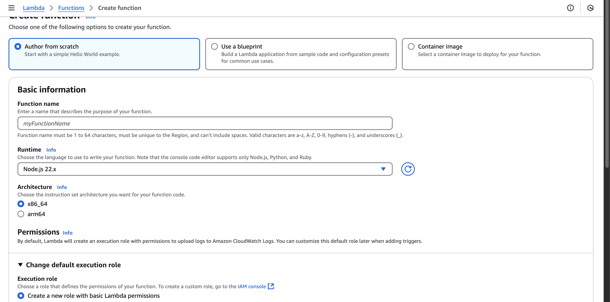
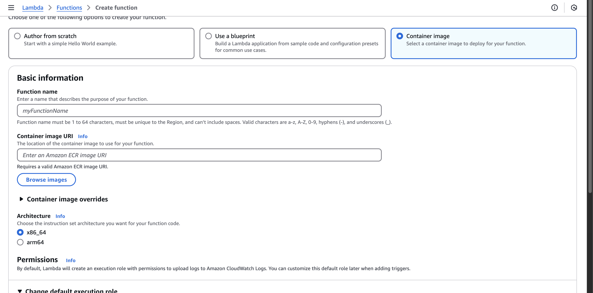

# AWS Lambda
AWS Lambda is a service that runs your code only when triggered, without you worrying about servers.
* You don’t need to manage or set up any servers (like EC2 or traditional hosting).
* You just write a function → upload it → and AWS runs it when it’s triggered.



# Working of the AWS Lambda
1. **Event Sources/Triggers** - Lambda functions are triggered by events from various AWS services (like S3, API Gateway, DynamoDB) or custom applications.
2. **Function Invocation**: Once the lambda gets triggered following things will happen.
    1. Finding appropriate function to run, If function is already present then it will use that and 2nd and 3rd is skipped
    2. Allocates Necessary compute resources and sets up environment.
    3. Loads the function.
    4. Passes event data to the function
3. **Execution Environment**: Lambda creates a secure, isolated environment (container) for your function with:
    1. The runtime environment you selected (Node.js, Python, Java, etc.)
    2. Memory and CPU resources based on your configuration
    3. Any layers or dependencies you've specified
4. **Code Execution**: Your function code executes, processing the event data and performing your defined actions.
5. **Result Handling**: After execution, Lambda
    1. Returns results to the triggering service (if applicable)
    2. Logs function execution details to CloudWatch
    3. Maintains the execution environment for a short period in case of additional invocations
6. **Resource Management**: If no further invocations occur, Lambda eventually terminates the execution environment, and you only pay for the compute time used.

> Note: In Lambda there is an issue to cold start due to above mentioned steps to avoid we can use **provisioned concurrency** Keeping it warm 24/7.
> Code can only run 15 min any longer than that might lead to **Execution Timeout**

## Provisioned Concurrency
Normally, AWS starts a new container when traffic arrives (causing a cold start). But with provisioned concurrency:
* AWS pre-warms containers
* They are instantly available
* No cold starts, ever

### Using Provisioned Concurrency
1.	Go to Lambda > Your Function
2.	Click on Versions
3.	Publish a new version
4.	Click on “Concurrency” tab
5.	Choose “Add provisioned concurrency”
6.	Select version and set number of instances (e.g., 5)

> Note: It does not work on $LATEST, It works on published versions or Alias

# Key Components
1. **Runtime environments**: Can choose from `Python`, `Node`, `Java`, `Ruby`,`.net`, `OS-only`.
2. **Memory Allocation**: Can allocate from 128MB to 10GB. 
3. **Execution Timeout**: 3 sec to 15 Min.
4. **IAM Roles And Permission**
5. **Setting Environment Variables**
6. **VPC Configurations**


# Deployment in AWS Lambda
1. Write code in any format and export one language (Python, Node, Java, Ruby, .Net), With all necessary dependency
Here is boiler-plate code for Node.js
```js
module.exports = async(event) => {
    return "Hello World";
}
```

2. Package the code with either zipping files or containerization.
    1. If size is small or medium then its better to zip the files.
    2. If size is large then using docker and AWS ECR (Elastic Container Registry) create docker image.
3. Deployment of the package in lambda function.
    1. If lambda function does not exists then create a new function,
        1. For Non docker image function you can select the build from scratch, And select desired runtime, Execution timeout, Memory etc.
        

        2. For Docker Image Select `Container Image`,
        then browse the image which should be present in AWS ECR.
        
    2. Function name should be unique to each region of your lambda function.

4. If you choose zip then you have two options to deploy the code you can either directly upload the zip file to the lambda function or you can add the zip file in s3 and using s3 link you can deploy (This is efficient if you have larger zip file).


    
